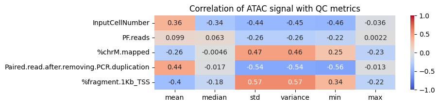

# abT-gdT-cells-Team3

## Introduction

Understanding how the immune system works and how gene expression is regulated can provide valuable insights into immune cell development and specialization. 

ATAC-seq is a high-throughput sequencing method that profiles chromatin accessibility, localizes open chromatin regions (OCRs), and identify potential cis-regulatory elements (CREs) in the genome. RNA-seq reveals information about the transcriptome of a cell by quantifying gene expression.

During differentiation, changes occur in chromatin accessibility and gene expression, controlled by cis-regulatory elements (CREs). Linking CRE information (ATAC-seq) of DNA to gene expression patterns (RNA-seq) enables us to characterize regulatory mechanisms of cellular identity and specialization.

These insights can have direct implications on drug development - such as predicting therapy responses and engineering immune cells - as well as understanding disease mechanisms like autoimmune diseases better.

This project investigates the transcriptional regulation of 90 different immune cell types. By integrating information of chromatin accessibility (ATAC-seq dataset) and gene expression (RNA-seq dataset) we aim to identify and classify CREs, and to explore their relationships to cell lineage and differentiation.

Key words: Immune cell differentiation, Transcriptional regulation, Chromatin accessibility, Cis-regulatory elements (CREs)

References: 
- Yoshida et al. (2019) 
- Further references: see GitHub repository

## Key questions

The project can be divided to a few key aspects:
1. Characterization of the chromatin landscape
2. Classify and localize CREs
3. Identify clusters of chromatin signal / gene expression and look for (known) relations

Further investigating the data, we can define more detailed questions according to the guideline we were given:
1. Characterization of the chromatin landscape
1.1 How variable is the chromatin signal within and across cells? (1.i.a, 1.ii: nur descriptive plots)
1.2 Should some peaks or cell types be removed due to technical issues (quality control) or lack of signal? Should we apply additional normalization or thresholds? (1.i.b, 1.ii.a)

2. Identification and classification of CREs
2.1 How do we define (CREs) ? / Promoter/Enhancer and other descriptive categories? (1.ii. allgemein)
2.2 Does the signal vary significantly between Promoter and Enhancer? (1.ii.b)
2.3 Are CREs related to TSS distance and how are they located? (2.iii.a)
2.4 How are CREs associated with genes? (2.iii.b,c,d,e,f, 2.iv.a,b)
2.5 Are there multifunctional CREs or other irregularities? (2.iii.g)
2.6 Which CREs control ab and gd T cell lineage specific genes?
2.7 How do we characterize acivating and repressing genes/CREs?? (1.ii, 2.iv.e,f,g,h (&comparison w/ and w/o regression!))

3. Identifcation of clusters of chromatin signal / gene expression and finding (known) relations
3.1 How do cell types cluster based on OCR and based on gene expression? (1.iii.,b; 2,ii; 2.i)
    3.1.1 Do they reproduce known relationship between cells and between OCR and gene expression? (1.iii.a, 2.i, 2.ii.a,(b))
3.2 How do peaks (ATAC) cluster together? (1.iv.a,b)
    3.2.1 (How) do they differ from cell lineage specific clusters? (1.iv.c,d)
3.3 Does the clustering change in respect to effect direciton on gene expression? (2.iv.i)
3.4 Do CREs show specific properties within clusters

## Dataset and Methods

For exploring and analzing the data, we focus on covering these points:

- Descriptive Analysis
- Exploratory Data Analysis
    - Graphical representations
    - Dimension reduction
    - Testing
- Regression

We established a file "functions.py", in which defined functions can be saved to establish an integrating workflow for the team.
Code development and troubleshooting were assisted of AI-based tools such as ChatGPT.

## Results

1. Characterize the chromatin landscape

-> QC, normalization, thresholding

2. Identify and characterize CREs 
- R2 distribution accross cells histogramm

lineage specific cres:
- coeff shift plot
- plot top genes all vs lineage
- top abgd cres r2 score
- histograms showing top cres for ab, gd and abgd
- r2 variance as comparison
- lasso coeff for scd2

3. Identify clusters of chromatin signal / gene expression and look for (known) relations

- umap rna & umap ATAC
- correlation of rna/atac umap
- hierarichal clustering of atac vs gene expression data

    - rna data: correlation of leiden clusters with cell type

## Discussion
chatg:
----
A typical scientific Discussion should:
Restate Major Findings
    Brief summary of the most important results and what they mean.
Interpretation
    How do these findings advance understanding of immune cell regulation?
    Compare to existing knowledge/literature.
Strengths and Limitations
    What is especially novel or robust?
        Are there any technical, data, or methodological limitations?
Implications/Applications
    How could these findings be applied in medicine or future research?
    Any potential for drug development, disease modeling, etc.?
Future Directions
    What would be the next steps for analysis?
    Further experiments, other datasets, functional validation?

- Summary of main results (What did you find regarding CREs, cell type clustering, relation to gene expression?)
- Biological interpretation (How does this relate to what is known? Did you discover novel CREs, unexpected clusters, or regulatory logic?)
- Technical strengths and caveats (Data integration, quality, computational methods, etc.)
Translational/medical relevance (How might these results impact biomarker discovery, therapy, etc.?)
- Recommendations for future work (What analyses or experiments would you add?)
----