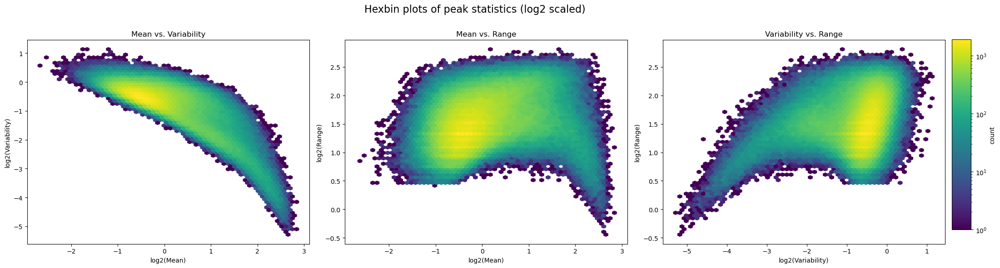
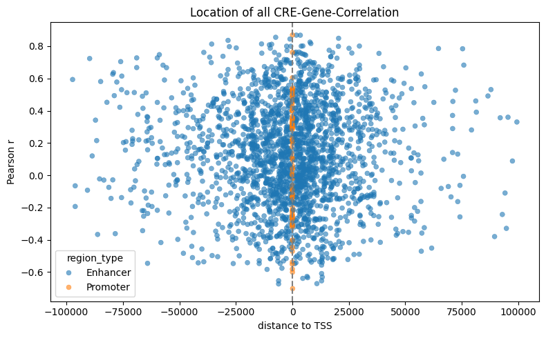

# abT-gdT-cells-Team3

## Introduction

Understanding how the immune system works and how gene expression is regulated can provide valuable insights into immune cell development and specialization. 

ATAC-seq is a high-throughput sequencing method that profiles chromatin accessibility, localizes open chromatin regions (OCRs), and identify potential cis-regulatory elements (CREs) in the genome. RNA-seq reveals information about the transcriptome of a cell by quantifying gene expression.

During differentiation, changes occur in chromatin accessibility and gene expression, controlled by cis-regulatory elements (CREs). Linking CRE information (ATAC-seq) of DNA to gene expression patterns (RNA-seq) enables us to characterize regulatory mechanisms of cellular identity and specialization.

These insights can have direct implications on drug development - such as predicting therapy responses and engineering immune cells - as well as understanding disease mechanisms like autoimmune diseases better.

This project investigates the transcriptional regulation of 90 different immune cell types. By integrating information of chromatin accessibility (ATAC-seq dataset) and gene expression (RNA-seq dataset) we aim to identify and classify CREs, and to explore their relationships to cell lineage and differentiation.

Key words: Immune cell differentiation, Transcriptional regulation, Chromatin accessibility, Cis-regulatory elements (CREs)

References: 
- Yoshida et al. (2019) 
- Further references: see GitHub repository

## Key questions

The project can be divided to a few key aspects:
1. Characterization of the Chromatin Landscape
2. Identification and Classification of CREs
3. Identifcation of Clusters of Chromatin Signal / Gene Expression and Finding Relations

Further investigating the data, we can define more detailed questions according to the guideline we were given:
1. Characterization of the Chromatin Landscape
1.1 How variable is the chromatin signal within and across cells? (1.i.a(da), 1.ii: nur descriptive plots)
1.2 Should some peaks or cell types be removed due to technical issues (quality control) or lack of signal? Should we apply additional normalization or thresholds? (1.i.b, 1.ii.a)

2. Identification and Classification of CREs
2.1 How do we define (CREs) ? / Promoter/Enhancer and other descriptive categories? (1.ii. allgemein)
2.2 Does the signal vary significantly between Promoter and Enhancer? (1.ii.b)
2.3 Are CREs related to TSS distance and how are they located? (2.iii.a(da))
2.4 How are CREs associated with genes? (2.iii.b,c,d,e,f(da), 2.iv.a,b)
2.5 Are there multifunctional CREs or other irregularities? (2.iii.g(da))
2.6 Which CREs control ab and gd T cell lineage specific genes?
2.7 How do we characterize acivating and repressing CREs? (1.ii, 2.iv.e,f,g,h (&comparison w/ and w/o regression!))

3. Identifcation of Clusters of Chromatin Signal / Gene Expression and Finding Relations
3.1 How do cell types cluster based on OCR and based on gene expression? (1.iii.,b; 2,ii; 2.i)
    3.1.1 Do they reproduce known relationship between cells and between OCR and gene expression? (1.iii.a, 2.i, 2.ii.a,(b))
3.2 How do peaks (ATAC) cluster together? (1.iv.a,b)
    3.2.1 (How) do they differ from cell lineage specific clusters? (1.iv.c,d)
3.3 Does the clustering change in respect to effect direciton on gene expression? (2.iv.i)
3.4 Do CREs show specific properties within clusters?

## Dataset and Methods

For exploring and analzing the data, we focus on covering these points:

- Descriptive Analysis
- Exploratory Data Analysis
    - Graphical representations
    - Dimension reduction
    - Testing
- Regression

We established a file "functions.py", in which defined functions can be saved to establish an integrating workflow for the team.
Code development and troubleshooting were assisted by AI-based tools such as ChatGPT.

Raw data sets:

[ATAC](https://sharehost.hms.harvard.edu/immgen/ImmGenATAC18_AllOCRsInfo.csv)
[RNA](https://www.cell.com/cms/10.1016/j.cell.2018.12.036/attachment/4392da81-c56e-471a-b1df-0e72f03ecd77/mmc2.csv)
[QC](https://www.cell.com/cms/10.1016/j.cell.2018.12.036/attachment/e5df7329-d77d-40b3-a03a-34bdbe4b402c/mmc1.xlsx)
[exon/TSS loc](http://hgdownload.cse.ucsc.edu/goldenPath/mm10/database/refFlat.txt.gz)
The columns in this file are: Gene Name , Transcript Name, Chromosome, Strand, 5' transcript Start, 3' Transcript Start, Coding Region 5' Start, Coding Region 3' Start, Exon Count, Exon Starts, Exon Ends

## Results

1. Characterize the chromatin landscape

The variability of chromatin signals across immune cell types is generally high, indicating diverse regulatory activity. Some cell types exhibit lower variability, possibly due to biological uniformity or technical factors.

An inverse relationship between mean chromatin accessibility and variability indicates that high-signal regions tend to be broadly accessible (constitutive), whereas moderate signals correspond to more specialized, cell type-specific regions. Peaks with low variability and range may represent inactive or uniformly accessible chromatin.

2. Identify and characterize CREs 

Chromatin accessibility is highest near transcription start sites (TSS), strongly suggesting promoter regions. Accessibility significantly decreases with increased distance, indicating distal regions likely represent enhancers.

Accessibility rapidly declines with increased distance from the TSS, highlighting that regulatory elements close to gene promoters are most actively accessible, while distal regions show lower but biologically relevant accessibility, characteristic of enhancers.

Promoters exhibit significantly higher chromatin accessibility than enhancers, consistent with their role in constitutive gene regulation. Enhancers show lower and more variable accessibility reflecting their context-specific regulatory roles.

Many CRE-gene pairs show strong, significant positive correlations, underscoring a robust relationship between chromatin accessibility and gene expression. The presence of highly significant CRE-gene associations indicates active regulatory interactions.

Most strongly correlated CREs cluster near the TSS, affirming proximal regulation. Nonetheless, distal CREs also show strong correlations, emphasizing long-range regulatory mechanisms within the genome.

Most CREs regulate only a few genes, indicating specific regulatory roles. However, a subset of CREs regulates multiple genes, highlighting potential multifunctionality and complex regulatory networks in immune cells.

- R2 distribution accross cells histogramm

lineage specific cres:
- coeff shift plot
- plot top genes all vs lineage
- top abgd cres r2 score
- histograms showing top cres for ab, gd and abgd
- r2 variance as comparison
- lasso coeff for scd2

3. Identify clusters of chromatin signal / gene expression and look for (known) relations

- umap rna & umap ATAC
- correlation of rna/atac umap
- hierarichal clustering of atac vs gene expression data

    - rna data: correlation of leiden clusters with cell type

Results 3. 

Cell types form distinct clusters in UMAP space that largely correspond to known lineages, with preT cells bridging stem/progenitor and mature T cell populations, indicating a smooth transition in chromatin accessibility during differentiation.

Hierarchical clustering of ATAC-seq profiles shows lineage-concordant grouping, with clear separation of B, T, myeloid, and progenitor cells, reflecting known hematopoietic hierarchies.

Chromatin-based clustering reveals high-level organization consistent with known hematopoietic lineages and captures transitional populations such as preT within their developmental context.

Most Leiden clusters correspond strongly to single lineages (e.g., ILC, T.act, myeloid), demonstrating that chromatin accessibility alone is sufficient to recover biologically meaningful cell identities.

A substantial overlap between RNA-based and ATAC-based Leiden clusters suggests that open chromatin profiles and gene expression states are concordant and reinforce similar cellular groupings.

ATAC-seq-based Leiden clustering reveals discrete and well-separated groups in UMAP space, supporting the presence of distinct chromatin accessibility-defined cell states.

Coloring UMAP embeddings by known lineage annotations reveals that ATAC-seq-defined clusters map well onto known immune cell types, validating the accuracy of chromatin-based separation.

Leiden clustering overlays neatly onto the UMAP-defined structure, highlighting that unsupervised clustering of chromatin accessibility captures underlying lineage identities.

Correlation analysis based on chromatin signal shows that cell types cluster according to lineage, with strong internal coherence and biologically plausible relationships between related lineages like abT, gdT, and T.act.

Clustering of chromatin accessibility peaks reveals lineage-specific accessibility patterns that distinguish abT from gdT and preT cells, suggesting regulatory divergence within the T lineage.

ATAC peaks cluster by cell lineage, but also reveal shared accessibility between developmental intermediates (e.g., preT) and mature lineages, indicating gradual chromatin remodeling across differentiation.

Both lineage-based and Leiden-based clustering show clear, coherent groupings in t-SNE space, with substantial concordance between transcriptional identity and unsupervised chromatin structure.

Open chromatin regions (peaks) cluster by dominant lineage, showing that regulatory elements are selectively accessible in lineage-specific contexts.

## Discussion

Key Findings:

Across 90 immune cell types, chromatin accessibility patterns reveal lineage relationships and can explain translational regulation.
CREs show diverse regulatory behaviors, including both one-to-one and multifunctional gene associations.
In aß and yo T cells, specific CREs explain high expression variance and mark subset-specific regulatory programs.

Limitations:

some variance remains unexpalined, likely due to complex or distal regulation.

Outlook:

Incooperating TF motif enrichment or proteomics may refine the definition of CRE and gene expression.
public